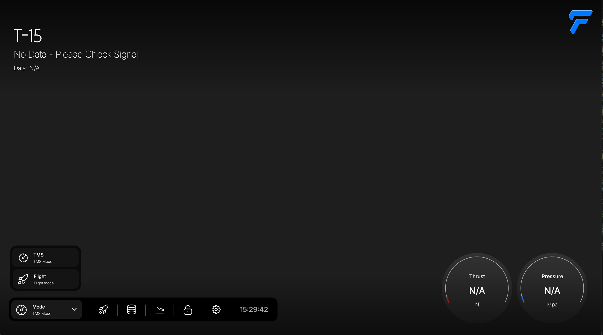

# 🚀 FCP (Flight Control Program)

FCP는 한울 로켓 프로젝트를 위한 **지상 통제용 GUI 소프트웨어**입니다. 실시간 센서 데이터 시각화, 점화 신호 처리, 시퀀스 제어 및 로깅 기능을 갖춘 **PyQt5 기반의 데스크탑 어플리케이션**입니다.



---

## 📦 설치 방법

1. Python 3.8 이상이 설치되어 있어야 합니다.
2. 아래 명령어로 필요한 패키지를 한 번에 설치하세요:

```bash
pip install -r requirements.txt
```

---

## 🧩 사용된 주요 라이브러리

- `PyQt5`: GUI 프레임워크
- `pyqtgraph`: 빠른 실시간 그래프 출력
- `pyserial`: 시리얼 통신
- `numpy`: 데이터 처리
- `pygame`: 사운드 및 간단한 이벤트

---

## ▶️ 실행 방법

```bash
python FCP_Flash_V4.py
```

---

## 🔧 주요 기능

- 📈 **추력 / 압력 실시간 그래프 표시**
- 🧠 **시퀀스 기반 점화 로직 제어**
- 🔧 **시리얼 포트 자동 탐지 및 연결**
- 💾 **로깅 기능 (시간별 센서 데이터 저장)**
- 🧨 **점화 신호 감지 및 시각적 알림**
- 🌀 **애니메이션 기반 게이지 UI**
- 💡 **시뮬레이션 모드 지원**

---

## 🗂 디렉터리 구조 예시

```
FCP/
├── img/
│   └── gauge/
│       ├── Gauge_B_01.png
│       ├── Gauge_B_02.png
│       └── ...
├── FCP_Flash_V4.py
├── requirements.txt
└── README.md
```

---

## 🙋‍♀️ 개발자

- **윤보배 (Yoonbobae)**  
  경상국립대학교 항공우주공학부  
  ✉️ 문의: [이메일 또는 깃허브 주소]
